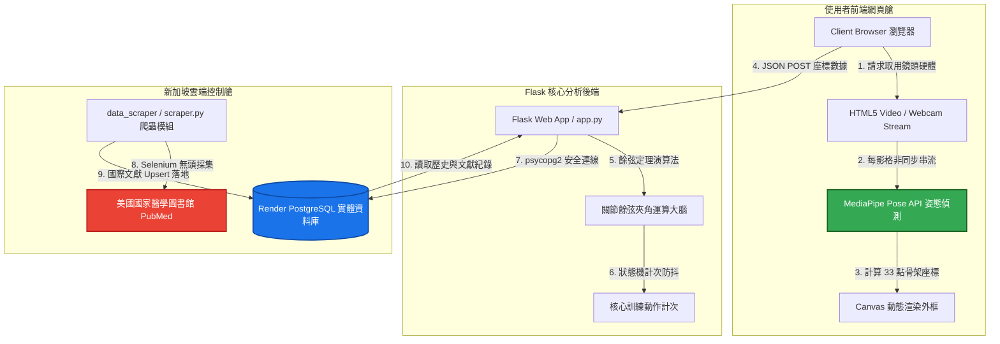

# ⚡ CyberFit  AI 運動分析平台

## 一、 專題簡介
CyberFit 賽博 AI 運動艙是一套智慧居家健身與姿態幾何偵測平台，主要用來協助學員了解自身居家徒手訓練時的核心與下肢代償狀況。系統透過 Flask 建立網站後端架構，使用 Render PostgreSQL 儲存學員歷史訓練數據與爬蟲文獻標準，並透過 Dashboard 呈現數據控制艙的去噪心法與長期體能佔比統計結果。

本專題希望解決居家徒手訓練中「不知道自己姿勢是否標準、產生何種代償動作」的問題，讓學員可以透過網站快速查看即時餘弦夾角、歷史紀錄與資料分析結果，進而選擇更適合的自主醫學訓練課表。

---

## 二、 成員名單與小組分工

分工如下：

* **414170388 陳翊銜**
    * **核心技術**：負責美國國家醫學圖書館 (PubMed) 自動化數據爬蟲模組之開發（data_scraper/scraper.py）。
    * **大數據工程**：實作大數據清洗、去噪與雲端資料庫（Render PostgreSQL）標準動態表結構之建立。
    * **資料應用**：負責 Dashboard 後端關節數據統計、多動作使用率長條圖與圓餅圖之分析算法設計。
* **414170205 葉丞恩**
    * **雲端架構部署**：配置生產級 WSGI（Gunicorn）伺服器，完成 Render Web Service 與 PostgreSQL 雲端分散式環境佈置。
    * **版本控制**：主導 GitHub 團隊開發分支管理（Branch Management）與持續整合（CI/CD）管線監控。
    * **前端 UI/UX**：主導網站主視覺色彩計畫、自適應響應式外觀佈局與交互介面之工程設計。
* **414170455 陳品宸**
    * **全端系統整合**：負責 Flask 核心後端路由控制（app.py）與幾何分析演算法（API）之全功能實作。
    * **AI 電腦視覺**：串接前端 MediaPipe Pose 33 點姿態特徵點提取，研發核心三維餘弦代償偵測算法與狀態機計次防抖系統。
    * **系統測試與交付**：主導本地端與雲端端到端連動測試、系統異常捕獲（Exception Handling）偵錯，以及高畫質成果演示影片之錄製與講解。

---

## 三、 專題動機
在校園與居家生活中，學員常常需要尋找能夠在沒有專業教練指導下，安全進行徒手肌力訓練的方法。然而，相關的訓練資訊通常不透明，許多線上健身課程也缺乏客製化的醫學課表排程。

這樣不僅容易造成代償動作而產生運動傷害，也降低了居家空間自主訓練的效率。因此，本專案希望建立一套結合電腦視覺與大數據採集的智慧控制艙平台，協助學員快速判斷並執行適合個人的體能與醫學指引課表。

---

## 四、 專案目標
本專案目標如下：
1. 建立 GitHub repository，完成版本控制與程式碼管理。
2. 使用 Flask 建立網站前端與後端系統。
3. 使用 Render PostgreSQL 建立雲端資料庫。
4. 完成人體動態姿態幾何計算、查詢與顯示功能。
5. 建立 Dashboard 頁面，呈現人流與體能數據統計圖表。
6. 建立 scraper.py，從外部網站爬取真實運動科學文獻並寫入 PostgreSQL。
7. 新增 /events 頁面顯示爬蟲活動資料與黃金夾角標準。
8. 將 Flask 網站部署至 Render，完成可公開展示的線上系統。
9. 規劃未來串接 OpenCV、YOLO、Jetson Orin Nano 與攝影機，發展成即時動態辨識平台。

---

## 五、 系統功能
本系統目前完成以下功能：
1. 首頁介紹 CyberFit 賽博 AI 運動艙專題。
2. 新增學員實時運動幾何紀錄。
3. 查詢歷史運動與代償紀錄。
4. 顯示人流與體能資料 Dashboard 圖表。
5. 計算核心關節夾角、總訓練量與組數使用率。
6. 顯示不同動作（如深蹲、弓箭步）的使用率長條圖。
7. 使用 scraper.py 從外部學術網站爬取資料。
8. 將權威醫學文獻與 FAQ 數據寫入 Render PostgreSQL。
9. 於 /events 頁面顯示爬蟲活動與發力要領。
10. 部署至 Render，提供線上網站展示。

---

## 六、 系統架構

本專題之整體大數據管線與電腦視覺端對端（End-to-End）架構設計如下圖所示：



---

## 七、 資料庫設計
本專題使用 Render PostgreSQL 作為雲端資料庫。

| 欄位名稱 | 說明 |
### 1. scraped_events (爬蟲文獻與活動表)
此資料表用來儲存爬蟲取得的外部運動科學與醫學指引資料。
| 欄位名稱 | 說明 |
| :--- | :--- |
| **id** | 活動/文獻編號 |
| **title** | 爬取到的連結文字或論文標題 |
| **event_date** | 爬取/發表日期 |
| **location** | 資料來源位置與發力肌群 |
| **source_url** | 爬取到的來源真實網址 |
| **created_at** | 建立時間 |

---

## 八、 爬蟲資料來源說明
本專題建立 scraper.py 作為外部資料收集模組。原本版本是以程式碼內建資料作為模擬展示，目前已修改為實際從外部網站爬取資料。

### 目前爬蟲來源網址
* [https://pubmed.ncbi.nlm.nih.gov/](https://pubmed.ncbi.nlm.nih.gov/)

### 目前 scraper.py 的流程如下：
1. 使用 requests 或 selenium 連線至醫學文獻搜尋網站。
2. 使用 BeautifulSoup 或 Webdriver 解析網頁 HTML。
3. 從網頁中擷取指定標籤的標題文字與連結。
4. 將抓到的 title、event_date、location、source_url 寫入 Render PostgreSQL 的 scraped_events 資料表中。
5. 在 /events 頁面顯示爬蟲清洗後的成果。

### 爬蟲程式碼位置：
* [https://github.com/Chloris03/CampusEye-Lite/blob/main/data_scraper/scraper.py](https://github.com/Chloris03/CampusEye-Lite/blob/main/data_scraper/scraper.py)

### 爬蟲結果顯示頁面：
* [https://campuseye-lite.onrender.com/events](https://campuseye-lite.onrender.com/events)

💡 此功能展示了從外部網站取得資料、寫入資料庫，並在網站前端呈現完整流程。未來可進一步修改爬取校園公告、課表、運動資訊或天氣資料。

---

## 九、 使用技術
本專題使用以下技術：
* Python
* Flask
* PostgreSQL
* Render
* psycopg2
* python-dotenv
* gunicorn
* requests
* BeautifulSoup4 / Selenium
* HTML
* CSS
* Git
* GitHub

---

## 十、 專案頁面
| 頁面 | 功能 |
| :--- | :--- |
| / | 首頁 |
| /add_record | 新增人流/動作數據紀錄 |
| /records | 歷史紀錄查詢 |
| /dashboard | 資料分析 Dashboard 圖表 |
| /events | 外部爬蟲活動與文獻資料 |
| /about | 關於專題詳細介紹 |

---

## 十一、 執行方式

### 1. Clone 專案
```bash
git clone https://github.com/Chloris03/CampusEye-Lite.git
cd CampusEye-Lite
```

### 2. 建立虛擬環境
```bash
python3 -m venv .venv
source .venv/bin/activate
```

### 3. 安裝套件
```bash
pip install -r requirements.txt
```

### 4. 建立 `.env`
請在專案根目錄建立 `.env` 檔案，並加入：
```env
DATABASE_URL=你的 PostgreSQL 連線字串
```
⚠️ 注意：`.env` 內含資料庫密碼，不應上傳至 GitHub。

### 5. 執行爬蟲
```bash
python data_scraper/scraper.py
```
`scraper.py` 會從外部網站爬取資料，並將資料寫入 PostgreSQL 的 `scraped_events` 資料表。

### 6. 執行 Flask 網站
```bash
python app.py
```
本機開啟：[http://127.0.0.1:5000](http://127.0.0.1:5000)

---

## 十二、 部署資訊
本專題已部署至 Render。

* Render 網站連結：[https://campuseye-lite.onrender.com](https://campuseye-lite.onrender.com)
* GitHub 專案連結：[https://github.com/Chloris03/CampusEye-Lite](https://github.com/Chloris03/CampusEye-Lite)

### Render 部署設定：
| 項目 | 設定 |
| :--- | :--- |
| **Build Command** | `pip install -r requirements.txt` |
| **Start Command** | `gunicorn app:app` |
| **Environment Variable** | `DATABASE_URL` |
| **Database** | Render PostgreSQL |

---

## 十三、 目前完成進度
* 已建立 GitHub repository，完成版本控制。
* 已完成 Flask 專案基本架構。
* 已完成首頁、新增紀錄、歷史紀錄、Dashboard、活動資料與關於專題頁面。
* 已建立 Render PostgreSQL 雲端資料庫。
* 已完成 Flask 與 PostgreSQL 連線。
* 已完成人流與次數紀錄新增與查詢。
* 已完成 Dashboard 統計分析。
* 已新增 `scraper.py` 外部資料收集程式。
* 已將 `scraper.py` 從程式內建資料改為實際從外部網站爬取。
* 已使用 `requests` 與 `BeautifulSoup` 解析外部網站 HTML。
* 已將爬取到的標題、日期、位置、來源網址寫入 PostgreSQL。
* 已新增 `/events` 活動資料頁面，顯示 `scraper.py` 寫入的資料。
* 已將網站部署至 Render。

---

## 十四、 未來展望
1. 加入 OpenCV / YOLO 影像人頭與動作偵測。
2. 串接 Jetson Orin Nano 與攝影機硬體。
3. 新增多種語言版本
